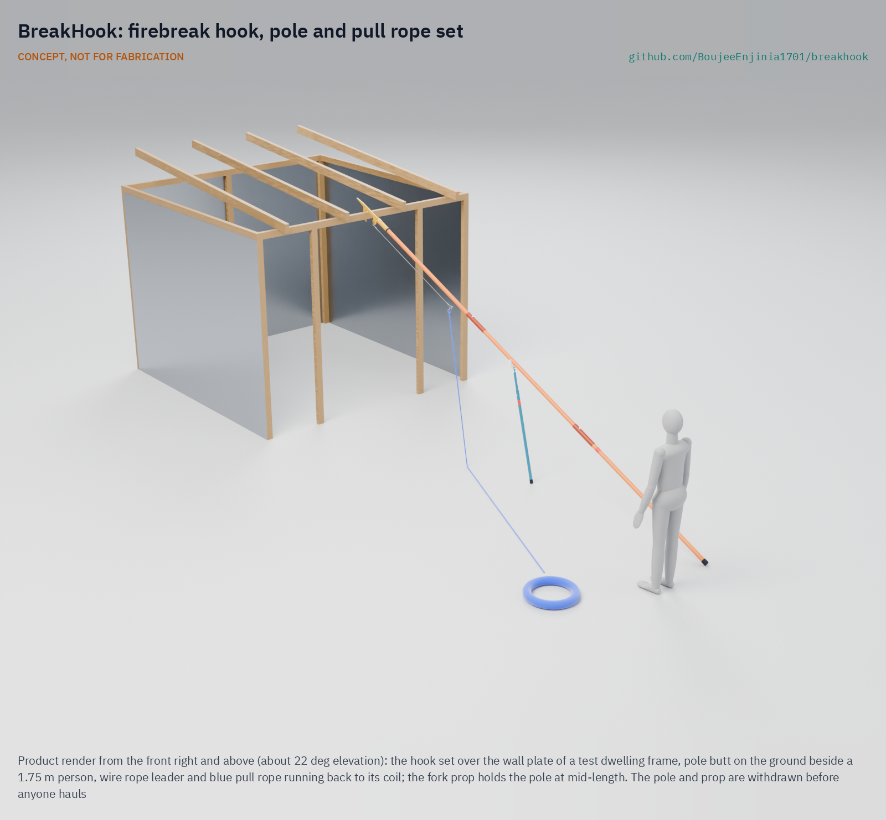
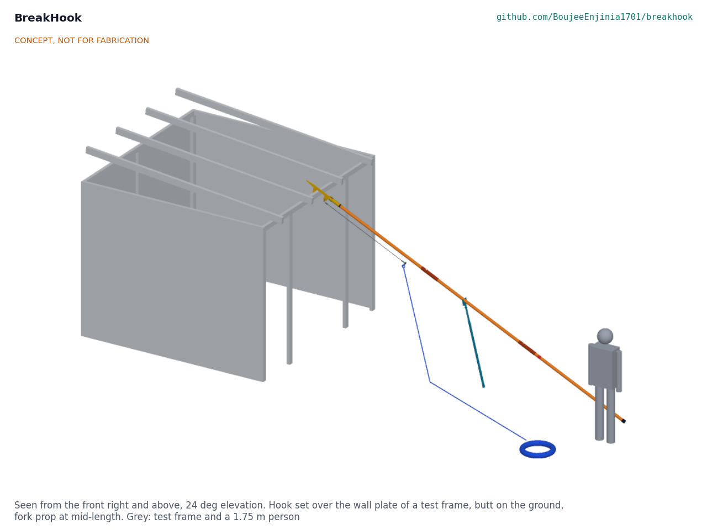

# BreakHook

   

**Area:** Situational field hardware · **TRL:** 3 of 9 (proof of concept on paper; constructable design) · **Value-engineering target:** USD 2,000; estimated kit cost USD 1,170 · **Difficulty:** 2 of 5

Lets residents pull a shack down from a safe distance to open a firebreak before a fire jumps across.

## Concept rationale

Pulling buildings down to stop a fire is an old method: in 1666 the Mayor of London was ordered to use fire hooks to pull down burning buildings ([London Fire Brigade Museum](https://www.london-fire.gov.uk/museum/london-fire-brigade-history-and-stories/fires-and-incidents-that-changed-history/the-great-fire-of-london/)). Residents of informal settlements do the same today, tearing down structures to make firebreaks ([Ngau and Boit, 2020](https://journals.sagepub.com/doi/10.1177/0956247820924939)). BreakHook gives them the tool for it: a long-reach steel hook on a non-conductive pole with a pull rope. The hook is set on a roof beam or wall frame from a distance, then a group hauls on the rope from well back to bring the structure down.

The value is distance. With a hook and rope, the people pulling stand clear of the fall zone and further from the heat. The kit is simple enough to keep at a community point, needs no power or water, and can be built by a local welder. It is meant as a last-resort tool inside a community fire plan, not a replacement for fire services, detectors or better spacing.

## Burning platform

Stellenbosch University fire engineers report that fires in Cape Town's informal settlements cause up to 115 deaths and destroy up to 4,500 dwellings a year, and that fire can spread between dwellings in under a minute ([Stellenbosch University, 2023](https://www0.sun.ac.za/researchforimpact/2023/10/10/su-fire-engineers-explore-risks-for-humans-and-dwellings/)). The 2017 Imizamo Yethu fire destroyed 2,194 dwellings and displaced more than 9,700 people, despite more than 170 firefighters working for over 13.5 hours ([Imizamo Yethu fire spread analysis](https://www.sciencedirect.com/science/article/abs/pii/S2212420918307623)).

Help often arrives late. A study of Dhaka and Cape Town found average fire service response times of 68 minutes in informal settlements against 28 minutes in formal residential areas, and pathways as narrow as 60 to 90 cm in parts of Dhaka ([Royal Academy of Engineering](https://engineeringx.raeng.org.uk/media/03cd1j4l/engx-a-comparative-study-of-fire-risk-emergence-in-informal-settlements-in-dhaka-and-cape-town-short.pdf)). In Nairobi, over 60 % of surveyed residents said they took part in fire response, including tearing down structures to create firebreaks ([Ngau and Boit, 2020](https://journals.sagepub.com/doi/10.1177/0956247820924939)).

## Where it could be used

### By industry

| Industry | Use |
| --- | --- |
| Community-based disaster risk reduction | A firebreak tool in a community fire kit alongside buckets, extinguishers and alarms |
| Municipal fire services | Equipment for trained community reservists who act before engines arrive |
| Humanitarian shelter and settlement programmes | Pre-positioned kit in dense camps and settlements |
| Red Cross and Red Crescent societies | Part of community fire response training |
| Urban upgrading and re-blocking programmes | Interim measure while spacing and access are improved |

### By country or region

| Country or region | Why it matters there |
| --- | --- |
| South Africa (Western Cape) | Up to 115 deaths and 4,500 dwellings lost to informal settlement fires in Cape Town each year ([Stellenbosch University, 2023](https://www0.sun.ac.za/researchforimpact/2023/10/10/su-fire-engineers-explore-risks-for-humans-and-dwellings/)). |
| South Africa (national) | A Khayelitsha New Year fire destroyed more than 1,000 shacks and displaced over 4,000 people; the city responded with re-blocking to create 3 m gaps ([The New Humanitarian, 2013](https://www.thenewhumanitarian.org/analysis/2013/01/23/south-africa-searches-solutions-shack-fires)). |
| Kenya | In Nairobi's informal settlements, residents tear down structures to create firebreaks while fire engines struggle with narrow access ([Ngau and Boit, 2020](https://journals.sagepub.com/doi/10.1177/0956247820924939)). |
| Bangladesh | The 2017 Korail fire in Dhaka destroyed 4,000 dwellings and displaced about 20,000 people ([Royal Academy of Engineering](https://engineeringx.raeng.org.uk/media/03cd1j4l/engx-a-comparative-study-of-fire-risk-emergence-in-informal-settlements-in-dhaka-and-cape-town-short.pdf)). |

## What sparked the idea

The idea came from two findings read side by side. Stellenbosch fire engineers found that fire can cross from one informal dwelling to the next in under a minute ([Stellenbosch University, 2023](https://www0.sun.ac.za/researchforimpact/2023/10/10/su-fire-engineers-explore-risks-for-humans-and-dwellings/)), while a study in Nairobi found that residents already respond by tearing down structures to make firebreaks, with over 60 % taking part in fire response ([Ngau and Boit, 2020](https://journals.sagepub.com/doi/10.1177/0956247820924939)). People are already doing the one thing that works in those first minutes, with their bare hands, next to the fire.

## Problem

In dense informal settlements, fire can jump from one dwelling to the next in under a minute, long before fire engines arrive. Residents already pull structures down to stop it, but they do it by hand, close to the flames.

Full problem statement: [docs/01-problem.md](docs/01-problem.md)

## Concept

A long-reach steel hook on a non-conductive pole with a pull rope; residents set it on a shack's roof beam or wall frame from a safe distance and haul together to pull the shack down, opening a firebreak ahead of a spreading fire.

Full design precis: [docs/02-concept.md](docs/02-concept.md) · Requirements: [docs/03-requirements.md](docs/03-requirements.md) · Calculations: [docs/04-calcs/01-sizing.md](docs/04-calcs/01-sizing.md) · Prototype build plan: [docs/05-build-plan.md](docs/05-build-plan.md) · Design decisions: [docs/06-design-decisions.md](docs/06-design-decisions.md) · General arrangement: [cad/drawings/BHK-DWG-001.pdf](cad/drawings/BHK-DWG-001.pdf) · 3D model: [media/viewer.html](media/viewer.html)

Key figures at TRL 3 (BHK-CAL-001): working pull 3 kN with every hook head proof-loaded to 6 kN; about ten haulers, the nearest 10.8 m from the wall; pole and hook head 7.82 kg; 3.67 m of insulated pole below the hook head; deployment in about 3 minutes from a store within 100 m. The fibreglass pole rests on a light fork prop at mid-length while the hook is set, which cuts the droop at the hook from about 0.66 m to 0.27 m; placement is the main thing a TRL 4 trial must confirm.

## Key components

- Hook head: profile-cut 10 mm steel plate welded into a slotted steel socket
- Non-conductive pole: three 1.8 m sections of foam-filled, certified fibreglass tube with bonded sleeves and nylon pins
- Wire rope leader and rated shackles
- Pull rope: 25 m of 12 mm polyester with ten hauling toggles on prusik cords
- Fall zone tape and stakes
- Locked, sealed wall rack
- Check card and rigger gloves

## Building the prototype

The first prototype is one set and its rack, built by a local welder and a small workshop: the hook plate is cut from 10 mm steel and welded into a slotted socket, the fibreglass pole sections are cut, drilled and joined with glued sleeves and nylon pins, and the rope system is bought from a rigging shop. Every component has a making sketch and every assembly step a picture. Each hook head is proof-loaded to 6 kN before it is issued. The plan is a plan, not yet built; building and testing to it is TRL 4 work.

## Safety

> Published as an open engineering reference, not certified equipment. Use only within a community fire plan agreed with the local fire service.
>
> Never pull a structure until two people have confirmed it is empty of people and animals.
>
> Never raise the pole within 3 m of any overhead or informal electrical line. The pole's insulated length is a second line of defence only; the hook, leader and shackles are metal and a wet rope conducts.
>
> Withdraw the pole and leave the fall zone before anyone hauls. Haulers stand at least 10 m from the wall and at least 1.5 times the structure's height away, on the side away from the fire, in gloves.
>
> Proof-load every hook head, leader and shackle set to 6 kN before issue and after any seal break; take a bent, kinked or frayed part out of service.
>
> Use only on free-standing, single-storey dwellings or end units, never on shared-wall rows, multi-storey or masonry buildings.
>
> Pulling a home down destroys it. The decision belongs to the community and its fire plan, not to the tool.
>
> This design is published as an open engineering reference. It is a TRL 3 concept, not for fabrication, and it is not certified equipment.

## Repository layout

| Folder | Contents |
| --- | --- |
| `docs/` | Problem, concept, requirements, calculations and design decisions |
| `cad/src/` | build123d Python source, the source of truth for all geometry |
| `cad/step/`, `cad/stl/` | Exported models for FreeCAD, other CAD tools and printing |
| `cad/drawings/` | 2D sketches and dimensioned drawings |
| `bom/` | Bill of materials |
| `electronics/` | KiCad schematics and PCB layouts |
| `firmware/` | Microcontroller code |
| `media/` | Renders, perspectives and photos |
| `build-log/` | Dated prototyping notes |

## Documentation

Controlled documents follow the portfolio [documentation standard](.kit/STANDARDS.md). Each carries a document ID (BHK-PRC-001 for the precis), a version and a revision history. Branded PDFs are built with `python .kit/render.py` and attached to GitHub Releases when a document is tagged, for example `BHK-PRC-001/v1.0`.

## Credits

Designed by Amish Chadha at Design Molecule Labs. See [CONTRIBUTORS.md](CONTRIBUTORS.md) for roles. To cite this design, use [CITATION.cff](CITATION.cff) (GitHub shows it as "Cite this repository").

AI assistance (Claude) was used to accelerate prototype documentation and first-pass research. Design direction and all decisions are Amish Chadha's, recorded in this repository's decision records (`docs/decisions/`).

## Licenses

- **Hardware** (CAD, drawings, BOM, electronics): [CERN-OHL-S v2](LICENSE)
- **Software** (firmware, scripts, notebooks): [MIT](LICENSE-SOFTWARE)

A project of the [Design Molecule](https://designmolecule.com) lab.
