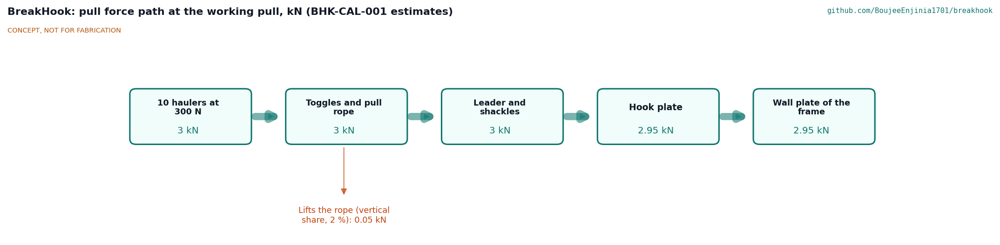
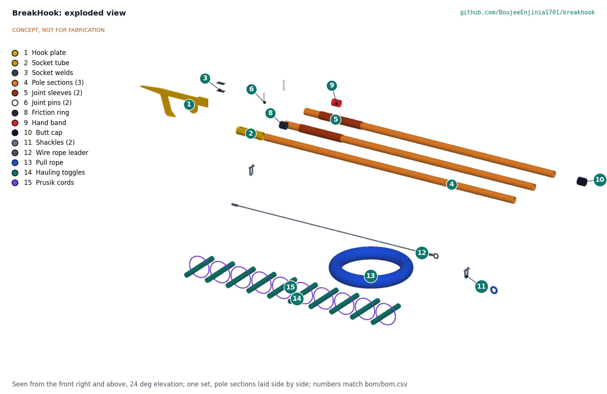

# BreakHook design precis

Lets residents pull a shack down from a safe distance to open a firebreak before a fire jumps across.

## Summary

BreakHook is a steel hook on a 5.9 m fibreglass pole, with a wire rope leader and a 25 m pull rope. A team of two sets the hook over a wall plate or rafter from 4 m away, withdraws the pole and steps clear; a crew of about ten on hauling toggles, at least 10 m back, pulls the dwelling down away from the fire's path. A community kit holds two sets in a locked, sealed wall rack with check cards, fall zone tape and gloves. The kit's estimated cost is USD 1,098 against a USD 2,000 value-engineering target, and the pole and hook head weigh 7.82 kg.

*Figure 1. Concept render: the hook over the wall plate of a test dwelling frame, pole butt on the ground. Grey parts are context.*

## How it works

1. **Check.** The caller works through the check card: the dwelling is empty of people and animals (two people confirm), there is no overhead or informal wiring within 3 m of where the pole will go, the dwelling is free-standing or the end of a row, and it is at least two dwellings ahead of the fire.
2. **Mark.** Two people tape off a fall zone in front of the dwelling, at least as deep as the dwelling is tall, plus the hauling lane.
3. **Set.** The pole team joins the three sections (two nylon pins), pushes the hook head onto the tip, and lifts the hook over the wall plate or a rafter end. The front person lifts, the rear person holds the butt down, both hands below the red band.
4. **Withdraw.** A firm 50 N pull frees the pole from the hook head. The pole team carries the pole back out of the fall zone.
5. **Haul.** The pull rope runs from the hook head, through a short steel wire leader, back to the crew. Ten haulers on toggles, the nearest 10.8 m from the wall, take up the slack and pull on the caller's word. The frame racks or tips toward them and falls inside the taped zone.
6. **Recover.** The hook is pulled out of the debris by the rope when it is safe to approach.

*Figure 2. Force path at the 3 kN working pull (estimates from BHK-CAL-001).*

## Main components

Table 1. Components of one set (numbers match bom/bom.csv)

| BOM | Component | What it is |
| --- | --- | --- |
| 1 | Hook plate | 10 mm S355 plate, profile cut: spike, 36 mm shank, arm raked back 17° that hangs 117 mm below the shank, rope tab with a 13 mm shackle hole |
| 2 | Socket tube | 50.8 x 2.0 steel tube, 180 long, slotted across one end for the plate |
| 3 | Welding and finishing | Four 6 mm fillet welds; zinc-rich primer and yellow paint; WLL 3 kN and serial stamped |
| 4 | Pole sections (3) | Foam-filled, electrical-grade fibreglass tube 44.5 x 3.2, 1.8 m each, with the maker's ASTM F711 certificate |
| 5, 6, 7 | Joints (2) | Fibreglass sleeve 50.8 x 3.2 x 300 bonded to the lower section; nylon 10 mm pin through the upper section |
| 8, 9, 10 | Friction ring, hand band, butt cap | Rubber tape ring for a 50 N release; red band 1.55 m from the butt; rubber cap |
| 11, 12 | Shackles and leader | Two rated 3/8 in bow shackles; 1.5 m of 6 mm galvanised wire rope with thimble eyes |
| 13 | Pull rope | 25 m of 12 mm polyester double braid, 25 kN or more, spliced eye |
| 14, 15 | Hauling toggles | Ten 300 mm fibreglass toggles on 6 mm prusik cords, 1 m apart from 11 m |

The community kit adds a wall rack (BOM 16, 17), paint (18), lock cable and numbered seals (19, 20), fall zone tape and stakes (21, 22), check cards (23), rigger gloves (24) and a proof load for each hook head (25).

*Figure 3. One set pulled apart; numbers match bom/bom.csv.*

## Key design choices

All made on 2026-10-03 under Amish's pre-approval; argued in BHK-DDR-001 (TRL 2 review) and BHK-DDR-002 (design for construction).

- **The pole places, the rope pulls.** The pole slides off the hook head and is withdrawn before the haul, so nobody holds anything inside the fall zone and the pole is never loaded by the pull.
- **Hook profile cut from one plate.** No forging; any welder with a plasma cutter, or a drill and grinder, can make it. The rope tab puts the pull in line with the arm, so the shank carries almost pure tension.
- **Foam-filled, certified fibreglass tube.** Electrical-grade tube is only insulating if its bore stays dry, hence foam fill, sealed ends, external sleeves and nylon pins. The pole is still never used within 3 m of overhead lines.
- **Wire rope leader.** The first 1.5 m from the hook is steel so heat and sheet edges at the dwelling do not cut the polyester rope.
- **No pulley in the base kit.** Ten toggles on prusik cords instead; a pulley needs an anchor that settlements rarely have.
- **Governance built into storage.** Locked rack, numbered seal, two keyholders and a use log answer the misuse concern in BHK-PRB-001.

## Numbers from the TRL 3 calculations

Table 2. Key figures (BHK-CAL-001)

| Quantity | Value |
| --- | --- |
| Pull to tip or rack the target dwelling | 2.15 to 3.0 kN (estimate) |
| Working pull, proof load | 3 kN, 6 kN |
| Haulers at 300 N | 10 |
| Nearest hauler from the wall | 10.8 m |
| Least factor on yield in the hook plate at proof | 2.3 (100 mm deep beam) |
| Rope, leader and shackle factors at the working pull | 7.5, 6.0, 3.3 |
| Pole and hook head mass | 7.82 kg |
| Lift and hold-down forces for the pole team | 252 N and 168 N |
| Hook droop at 25° | about 0.66 m |
| Insulated length | 3.67 m |
| Deployment within 100 m of the store | 3.0 min (estimate) |
| Value-engineering target | USD 2,000. Estimated cost of the constructable design: USD 1,098 (USD 902 under the target) |

## Patent design-arounds

From the preliminary patent, trademark and prior-art screen (not legal advice), all kept in the constructable design:

- Cite the historical fire-hook lineage; no live patent found close to the concept.
- Non-conductive tail on the pole: 3.67 m of foam-filled fibreglass with no metal below the hook head.
- Empty-shack check protocol before any pull: the first item on the check card.
- Name changed from GapHook to BreakHook to avoid GapHook Oy, a Finnish software company.
- Watch items from the preliminary screen, both answered in the design: overhead lines (3 m rule, insulated length) and the structure falling toward users (pole withdrawn, haulers beyond the fall zone).

## Shared blocks

- CalRig proof-load for the hook head, leader and shackles (6 kN for 1 minute before issue).

## Relationship to other lab projects

BreakHook is a Design Molecule Labs situational field hardware design. Its proof load uses the lab's CalRig rig where one is available; otherwise a rigging shop does it.

## Safety

> **Safety:** The hazards are a falling structure, a dwelling that is not empty, electrical wiring, a rope system failing under load, heat and smoke, and crowds. The safety stops are fixed by design and by the check card:
>
> - Never pull until two people have confirmed the dwelling is empty of people and animals.
> - Never raise the pole within 3 m of any overhead or informal line. The pole's insulated length is a second line of defence only; the hook, leader and shackles are metal and a wet rope conducts.
> - The pole is withdrawn and the pole team is out of the fall zone before anyone hauls.
> - Haulers stand at least 10 m from the wall and at least 1.5 times the dwelling's height away, on the side away from the fire, in gloves; nobody stands beside the rope line within the fall zone.
> - Every hook head, leader and shackle set is proof-loaded to 6 kN before issue and after any seal break; a bent hook, kinked leader or frayed rope is taken out of service.
> - Only free-standing dwellings or end units; never multi-storey or masonry buildings.
> - Pulling a home down destroys it. The decision belongs to the community and its fire plan, not to the tool.
>
> This design is published as an open engineering reference. It is not certified equipment.

## Open questions

None open. Every TRL 1 question was decided under Amish's 2026-10-03 pre-approval; facts that can only be settled with real parts are listed in the design decisions register (BHK-DEC-001).
